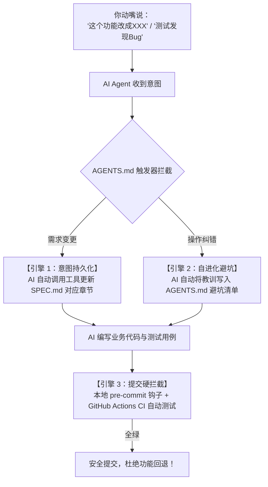

# ⚡ Vibe Coding Starter

<p align="center">
  <strong>专为 AI Agent 结对编程打造的“防翻车”通用规范驱动模版 (Spec-Driven Vibe Coding Starter)</strong>
</p>

<p align="center">
  
  
  
  
</p>

---

## 💡 为什么需要这个模版？

**“Vibe Coding（氛围编程）”** 让你只动嘴提需求就能快速成型项目，但几乎所有人都会遇到所谓的 **“Vibe Drift（上下文腐化 / 需求漂移）”** 绝症：
- **缺乏单一真理源**：上下文一长 AI 就失忆，修了 A 破坏了前天写好的 B；
- **反复横跳改回去**：测试中边测边提意见，没有落在纸面上的规范，代码改来改去最终退化；
- **缺乏物理防线**：没有自动化测试与 Git 提交门禁，坏代码直接进入仓库。

**Vibe Coding Starter** 通过 **【自动需求入库 SPEC】 + 【自学习避坑清单】 + 【物理级测试提交门禁】**，把初级的“纯聊天盲改”升级为真正的 **工业级规范驱动开发 (Spec-Driven Development, SDD)**。

---

## ⚙️ 核心架构与三大自动化引擎



### 1. 引擎一：口头意图自动持久化 (`SPEC.md`)
- 你不需要自己写文档！你只需在对话框里大白话提要求；
- `AGENTS.md` 规则强制约束 AI **禁止凭空盲改代码**，必须第一步自动调用工具修改 [SPEC.md](SPEC.md)；
- 需求永远物理落在磁盘上，换任何会话或 AI 都不可能丢失上下文。

### 2. 引擎二：错误与偏好自我进化 (`AGENTS.md`)
- 当你纠正 AI（例如：“别动某个配置”、“以后不准这样写”）；
- AI 会自动把该教训追加写入 `AGENTS.md` 底部的 **【历史教训与避坑清单】**；
- 规则永久沉淀进系统提示词，真正做到“吃一堑长一智”，绝不再犯同类错误。

### 3. 引擎三：物理级双层防倒退锁 (`TESTING.md`)
- **本地门禁 (`.git/hooks/pre-commit`)**：跨平台（Unix/Windows CRLF 免杀）纯 Unix LF 解释器兼容；支持 Python (.venv 自动探测与 pytest 回退)、Node.js (`npm test`)、Go (`go test`)、Rust (`cargo test`)；每次 `git commit` 秒级跑测，测试红灯物理拒绝提交；
- **远端门禁 (`templates/ci.yml`)**：一键激活 GitHub Actions，在干净虚拟机矩阵上回归测试，杜绝“带病合入”。

---

## 🚀 极速上手使用指南

### 第一步：基于本模板创建新项目
点击本仓库右上角的绿色按钮 **[Use this template]** ➔ **[Create a new repository]**。

### 第二步：Clone 到本地并激活门禁
```bash
git clone <你的新项目仓库地址>
cd <你的新项目文件夹>

# 一键安装本地 pre-commit 提交硬门禁 (跨平台支持，纯 LF 防炸裂)
python scripts/setup-hooks.py

# 💡 提示：若希望同时激活 GitHub Actions 远端 CI，可加上 --enable-ci 参数：
# python scripts/setup-hooks.py --enable-ci
```

### 第三步：一句话唤醒 AI 开始 Vibe Coding！
打开你的 AI 工具（**Anti Gravity**、**Cursor**、**Claude Code** 等），直接对它说第一句话：

> 🗣️ *“这是一个基于 Vibe Coding Starter 初始化的新项目。我们打算做一个 [你的项目想法，例如：一个极简的命令行剪贴板管理工具]。请首先阅读 AGENTS.md，然后帮我完善 SPEC.md 中的系统定位、架构与核心功能清单，并建立初始测试用例！”*

---

## 📁 目录文件清单

| 资产文件 | 作用与定位 |
| :--- | :--- |
| **`AGENTS.md`** | **AI 核心宪法**：约束 AI 自动改 SPEC、自动记避坑教训、强制跑测试、禁止 `--no-verify` |
| **`SPEC.md`** | **单一真理源 (SSOT)**：记录系统功能、数据流向、接口契约与边界条件 |
| **`DECISIONS.md`** | **决策账本**：记录“为什么改需求”的微日志时间线 (Lightweight ADR) |
| **`TESTING.md`** | **工程测试守则**：规定“缺陷即测试”与防退化三道防线 |
| **`.cursorrules`** | **多 IDE 兼容**：让 Cursor 等编辑器原生对齐本套工作流 |
| **`scripts/setup-hooks.py`**| **本地门禁安装器**：一键写入 `.git/hooks/pre-commit` (支持虚拟环境与多语言) |
| **`templates/ci.yml`** | **GitHub Actions CI 模版**：远端持续集成全量测试工作流模版 |
| **`tests/test_smoke.py`** | **基准冒烟测试**：保证开箱即通 (100% Green Out of the Box) |

---

## 📄 开源协议
本项目采用 [MIT License](LICENSE) 开源协议。
