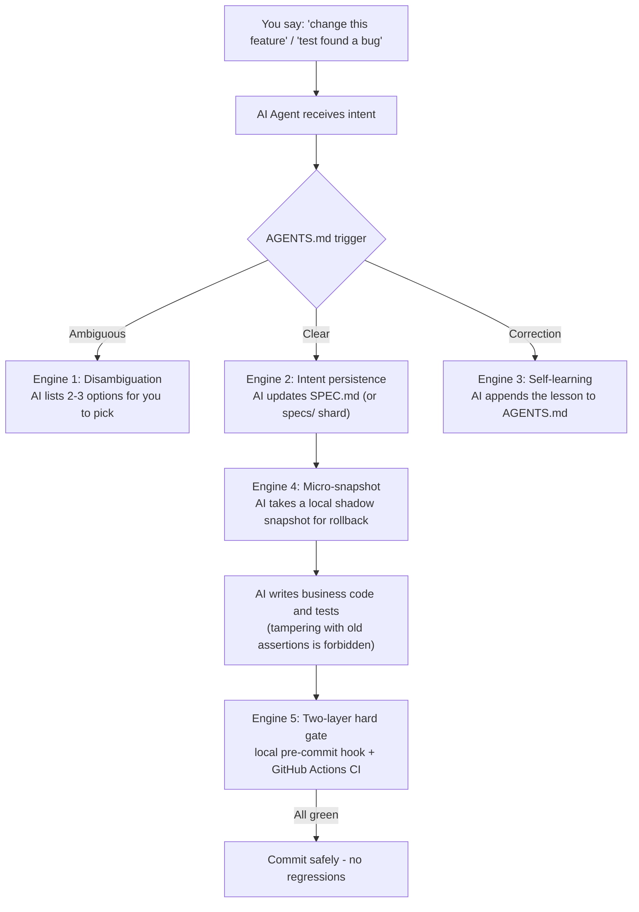

# ⚡ Vibe Coding Starter

<p align="center">
  <strong>An industrial-grade, anti-crash specification template built for AI-agent pair programming (Spec-Driven Vibe Coding).</strong>
</p>

<p align="center">
  
  
  
  
  
  
</p>

<p align="center">
  <a href="README.md">English</a> · <a href="README.zh-CN.md">简体中文</a>
</p>

---

## 💡 Why this template?

**Vibe Coding** lets you ship fast by just describing what you want — but almost everyone hits the same disease: **Vibe Drift**.
- **No single source of truth** — once the context grows, the agent forgets; you fix A and break B from two days ago.
- **Endless back-and-forth** — feedback happens in chat, never lands on paper, and the code degrades.
- **No physical defenses** — no automated tests, no commit gate; bad code walks straight into the repo.
- **No undo, no sandbox** — when the agent wrecks ten files, you can't roll back in seconds; "works on my machine" strikes.

**Vibe Coding Starter** upgrades plain "chat and pray" into real **Spec-Driven Development (SDD)** with five engines: *auto-persist intent into SPEC*, *self-learning lessons list*, *physical commit/CI gates*, *second-level micro-snapshots*, and *progressive spec sharding + containerized sandbox*.

---

## ⚙️ Architecture and the 5 engines


```mermaid
flowchart TD
    User["You say: 'change this feature' / 'test found a bug'"] --> Agent[AI Agent receives intent]
    Agent --> Check{"AGENTS.md trigger"}
    Check -->|Ambiguous| Ask["Engine 1: Disambiguation<br/>AI lists 2-3 options for you to pick"]
    Check -->|Clear| AutoSpec["Engine 2: Intent persistence<br/>AI updates SPEC.md (or specs/ shard)"]
    Check -->|Correction| AutoLearn["Engine 3: Self-learning<br/>AI appends the lesson to AGENTS.md"]
    AutoSpec --> Snap["Engine 4: Micro-snapshot<br/>AI takes a local shadow snapshot for rollback"]
    Snap --> AutoCode["AI writes business code and tests<br/>(tampering with old assertions is forbidden)"]
    AutoCode --> TestRun["Engine 5: Two-layer hard gate<br/>local pre-commit hook + GitHub Actions CI"]
    TestRun -->|All green| Push["Commit safely - no regressions"]
```

### 1. Engine 1 — Auto-persist spoken intent (`SPEC.md` and `specs/`)
- You never write the spec by hand. Just describe the requirement in plain language.
- `AGENTS.md` forbids the agent from editing code first: step one is always to update [SPEC.md](SPEC.md).
- **Progressive sharding**: under 500 lines everything lives in one file; beyond that, split sub-domains into [specs/](specs/) to fight long-context attention decay.

### 2. Engine 2 — Self-learning lessons (`AGENTS.md`)
- When you correct the agent ("don't touch that config", "never write code like this"), it appends the lesson to the **Lessons Learned** section at the bottom of `AGENTS.md`.
- The rule is then loaded in every future session. Once bitten, permanently shy.

### 3. Engine 3 — Two-layer physical regression lock (`standards/TESTING.md`)
- **Anti-test-tampering**: weakening assertions or deleting tests to fake a green run is a quality incident, not a fix.
- **Local gate** (`.git/hooks/pre-commit`): runs the suite on every commit and physically refuses a red tree. Auto-detects Python (`.venv` + pytest fallback), Node (`npm test`), Go (`go test`), Rust (`cargo test`).
- **Remote gate** (`.github/workflows/ci.yml`): GitHub Actions runs the same suite on a clean runner matrix. Red never merges.

### 4. Engine 4 — Second-level micro-snapshots (`tooling/checks/checkpoint.py`)
```bash
# Save a snapshot (no junk commits, no history pollution)
python tooling/checks/checkpoint.py save "before refactoring the core module"

# List snapshots
python tooling/checks/checkpoint.py list

# Wrecked it? Roll back in one second (your dirty tree is stashed first)
python tooling/checks/checkpoint.py restore
```

### 5. Engine 5 — Air-gapped dev container (`.devcontainer/`)
A preconfigured container spec. On any machine, click **"Reopen in Container"** in VS Code or Cursor and get an identical, dependency-complete environment.

---

## 🚀 Quick start

### Step 1 — Create your project from this template
Click **[Use this template]** → **[Create a new repository]**.

### Step 2 — Clone and arm the gates
```bash
git clone <your-new-repo-url>
cd <your-new-project>

# Install the local pre-commit gate (cross-platform, LF-only)
python tooling/checks/setup-hooks.py
```

### Step 3 — Wake the agent with one sentence
Open your AI tool (**Anti Gravity**, **Cursor**, **Claude Code**, …) and say:

> 🗣️ *"This is a new project initialized from Vibe Coding Starter. We're building [your idea]. Read AGENTS.md first, then help me fill in the positioning, architecture, and feature matrix in SPEC.md, and set up the initial test suite."*

---

## 📁 Repository layout

The tree is **layered by responsibility**. Anything convention-bound (README, AGENTS, SPEC, .cursorrules, .devcontainer) stays at the root; everything else lives in its layer.

```
/
├── README.md / README.zh-CN.md      Entry point (this file)
├── AGENTS.md / AGENTS.zh-CN.md      AI constitution - the highest-priority rules
├── SPEC.md / SPEC.zh-CN.md          Single source of truth for YOUR project
│
├── standards/                       Mother standards: how to do engineering
│   ├── RULES.md                     Master rule index (every rule, one ID, one home)
│   ├── TESTING.md                   Gates + Definition of Done
│   ├── REVIEWING.md                 Adversarial review recipes
│   ├── EXECUTION.md                 Multi-task execution loop
│   ├── ARCHITECTURE.md              Top-down architecture derivation
│   └── LOCALIZATION.md              i18n + theming architecture
│
├── docs/                            Your project's records
│   ├── START_HERE.md                Resume entry: read this first in a new session
│   ├── DECISIONS.md                 Lightweight ADR timeline
│   ├── CONSTRAINTS.md               Technical pitfalls of this codebase (Why + Date)
│   ├── REQUIREMENTS_TRACEABILITY.md Requirement ↔ evidence matrix
│   ├── optional/                    Capability-gated extensions
│   └── templates/                   Working templates (plan, evidence, OSS audit)
│
├── templates/                       Files copied into a new project's root
│   ├── SPONSOR.md                   Sponsorship + backers wall
│   └── FAQ.md                       Troubleshooting guide
│
├── specs/                           Progressive spec shards
├── tooling/
│   ├── checks/                      Gate scripts
│   └── tests/                       Test suite + visual smoke
├── .github/workflows/ci.yml         Remote CI gate (live, not just a template)
└── .agents/, .cursorrules, .devcontainer/   Host entry points
```

### Which file do I edit?

| I want to… | Edit | Then run |
|---|---|---|
| Change what the product does | `SPEC.md` | — |
| Record why a decision was made | `docs/DECISIONS.md` | — |
| Prove a requirement is actually done | `docs/REQUIREMENTS_TRACEABILITY.md` | — |
| Fix a bug | `standards/TESTING.md` §1 (test first) | the suite |
| Add or change a gate | `standards/TESTING.md`, then `standards/RULES.md` | `tooling/checks/*` |
| Add a UI language or theme | `standards/LOCALIZATION.md` | `tooling/checks/check_docs.py` |
| Teach the agent a lesson | `AGENTS.md` (Lessons Learned) | — |
| Record a pitfall in this codebase | `docs/CONSTRAINTS.md` | — |
| Start a new session | `docs/START_HERE.md` | — |

---

## 🌐 Bilingual policy

Every Markdown document exists in **two mirrored files**:

- `NAME.md` — **English** (the default, so GitHub renders it)
- `NAME.zh-CN.md` — **简体中文**

Both are first-class. Chinese is the authoring source; English mirrors it. `tooling/checks/check_docs.py` fails CI if a document exists in only one language, so neither side can silently rot.

---

## 📄 License

[MIT](LICENSE)
