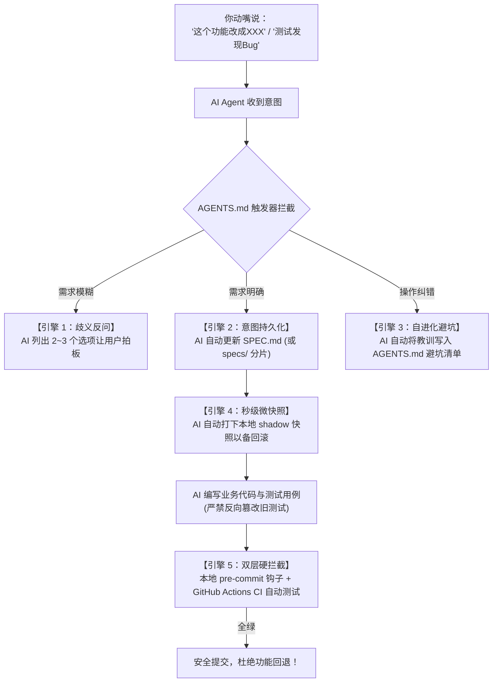

# ⚡ Vibe Coding Starter

<p align="center">
  <strong>专为 AI Agent 结对编程打造的“防翻车”通用工业级规范模版 (Spec-Driven Vibe Coding Starter)</strong>
</p>

<p align="center">
  
  
  
  
  
</p>

---

## 💡 为什么需要这个模版？

**“Vibe Coding（氛围编程）”** 让你只动嘴提需求就能快速成型项目，但几乎所有人都会遇到所谓的 **“Vibe Drift（上下文腐化 / 需求漂移）”** 绝症：
- **缺乏单一真理源**：上下文一长 AI 就失忆，修了 A 破坏了前天写好的 B；
- **反复横跳改回去**：测试中边测边提意见，没有落在纸面上的规范，代码改来改去最终退化；
- **缺乏物理防线**：没有自动化测试与 Git 提交门禁，坏代码直接进入仓库；
- **缺少后悔药与沙盒**：AI 一旦改崩多个文件难以秒级撤销，跨平台环境依赖容易出现“本地跑通，远端报错”。

**Vibe Coding Starter** 通过 **【自动需求入库 SPEC】 + 【自学习避坑清单】 + 【物理级测试提交门禁】 + 【秒级影子微快照】 + 【渐进式分片与容器化】**，把初级的“纯聊天盲改”升级为真正的 **工业级规范驱动开发 (Spec-Driven Development, SDD)**。

---

## ⚙️ 核心架构与 5 大自动化引擎



### 1. 引擎一：口头意图自动持久化 (`SPEC.md` 与 `specs/`)
- 你不需要自己写文档！你只需在对话框里大白话提要求；
- `AGENTS.md` 规则强制约束 AI **禁止凭空盲改代码**，必须第一步自动调用工具修改 [SPEC.md](SPEC.zh-CN.md)；
- **渐进式分片支持**：项目小时（< 500 行）全在一处；项目变大后自动拆入 [specs/](specs/) 细分子模块，防大模型长上下文注意力衰减。

### 2. 引擎二：错误与偏好自我进化 (`AGENTS.md`)
- 当你纠正 AI（例如：“别动某个配置”、“不要写这种代码”）；
- AI 会自动把该教训追加写入 `AGENTS.md` 底部的 **【历史教训与避坑清单】**；
- 规则永久沉淀进系统提示词，真正做到“吃一堑长一智”，绝不再犯同类错误。

### 3. 引擎三：物理级双层防倒退锁 (`standards/TESTING.md`)
- **防测试篡改**：严禁 AI 通过放宽断言预期或删除测试来伪造绿灯；
- **本地门禁 (`.git/hooks/pre-commit`)**：跨平台（Unix/Windows CRLF 免杀）纯 Unix LF 解释器兼容；支持 Python (.venv 自动探测与 pytest 回退)、Node.js (`npm test`)、Go (`go test`)、Rust (`cargo test`)；每次 `git commit` 秒级跑测，测试红灯物理拒绝提交；
- **远端门禁 (`.github/workflows/ci.yml`)**：一键激活 GitHub Actions，在干净虚拟机矩阵上回归测试，杜绝“带病合入”。

### 4. 引擎四：秒级无损微快照与后悔药 (`tooling/checks/checkpoint.py`)
- 在 AI 即将进行跨文件大重构前，提供无痛快照：
  ```bash
  # 保存快照 (不产生无用 commit，不污染历史)
  python tooling/checks/checkpoint.py save "重构核心模块前"

  # 查看快照历史
  python tooling/checks/checkpoint.py list

  # 改乱了一秒撤销
  python tooling/checks/checkpoint.py restore
  ```

### 5. 引擎五：开箱即用的气密开发容器 (`.devcontainer/`)
- 预置行业通用开发容器配置，换电脑或多环境部署时，在 VSCode/Cursor 中点击 **“Reopen in Container”**，瞬间获得一致的气密纯净环境，告别依赖缺失。

---

## 🚀 极速上手使用指南

### 第一步：基于本模板创建新项目
点击本仓库右上角的绿色按钮 **[Use this template]** ➔ **[Create a new repository]**。

### 第二步：Clone 到本地并激活门禁
```bash
git clone <你的新项目仓库地址>
cd <你的新项目文件夹>

# 一键安装本地 pre-commit 提交硬门禁 (跨平台支持，纯 LF 防炸裂)
python tooling/checks/setup-hooks.py

# 💡 提示：若希望同时激活 GitHub Actions 远端 CI，可加上 --enable-ci 参数：
# python tooling/checks/setup-hooks.py --enable-ci
```

### 第三步：一句话唤醒 AI 开始 Vibe Coding！
打开你的 AI 工具（**Anti Gravity**、**Cursor**、**Claude Code** 等），直接对它说第一句话：

> 🗣️ *“这是一个基于 Vibe Coding Starter 初始化的新项目。我们打算做一个 [你的项目想法，例如：一个极简的命令行剪贴板管理工具]。请首先阅读 AGENTS.md，然后帮我完善 SPEC.md 中的系统定位、架构与核心功能清单，并建立初始测试用例！”*

---

## 📁 仓库结构

目录**按职责分层**。凡是有约定位置要求的（README、AGENTS、SPEC、.cursorrules、.devcontainer）留在根目录，其余各归其层。

```
/
├── README.md / README.zh-CN.md      入口（本文件）
├── AGENTS.md / AGENTS.zh-CN.md      AI 宪法——优先级最高的规则
├── SPEC.md / SPEC.zh-CN.md          你这个项目的唯一真理源
│
├── standards/                       母规范层：怎么做工程
│   ├── RULES.md                     规则总账（每条规则一个 ID、一个归属文件）
│   ├── TESTING.md                   门禁 + 收敛交付标准 (DoD)
│   ├── REVIEWING.md                 对抗性审查配方
│   ├── EXECUTION.md                 多任务执行工序
│   ├── ARCHITECTURE.md              顶层架构推导法
│   └── LOCALIZATION.md              本地化与视觉主题架构
│
├── docs/                            你的项目记录
│   ├── DECISIONS.md                 轻量 ADR 时间线
│   ├── REQUIREMENTS_TRACEABILITY.md 需求 ↔ 证据矩阵
│   ├── optional/                    按需启用的扩展规范
│   └── templates/                   工作模板（计划 / 证据 / OSS 审计）
│
├── templates/                       复制进新项目根目录的成品文件
│   ├── SPONSOR.md                   赞助渠道与鸣谢墙
│   └── FAQ.md                       排查指南
│
├── specs/                           渐进式规范分片
├── tooling/
│   ├── checks/                      门禁脚本
│   └── tests/                       测试套件 + 视觉冒烟
├── .github/workflows/ci.yml         远端 CI 门禁（是活的，不只是模板）
└── .agents/、.cursorrules、.devcontainer/    各宿主入口
```

### 我要改 X，该动哪个文件？

| 我想…… | 改这里 | 然后跑 |
|---|---|---|
| 改产品行为 | `SPEC.md` | — |
| 记录某个决定为什么这么做 | `docs/DECISIONS.md` | — |
| 证明某需求真的做完了 | `docs/REQUIREMENTS_TRACEABILITY.md` | — |
| 修一个 Bug | `standards/TESTING.md` §一.1（先写测试） | 测试套件 |
| 加/改一条门禁 | 先 `standards/TESTING.md`，再 `standards/RULES.md` | `tooling/checks/*` |
| 加一种界面语言或主题 | `standards/LOCALIZATION.md` | `tooling/checks/check_docs.py` |
| 教 AI 一条教训 | `AGENTS.md`（避坑清单） | — |

---

## 🌐 双语策略

每份 Markdown 文档都有**两个镜像文件**：

- `NAME.md` —— **英文**（默认正本，GitHub 直接渲染这一个）
- `NAME.zh-CN.md` —— **简体中文**

两者都是一等公民。中文是撰写源，英文与之镜像。`tooling/checks/check_docs.py` 会在某份文档只存在于一种语言时让 CI 变红，因此两边都不会悄悄腐烂。

---

## 📄 开源协议
本项目采用 [MIT License](LICENSE) 开源协议。
