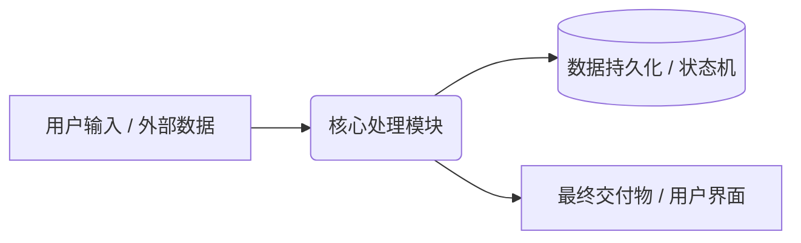

# [项目名称] 核心功能规范 (SPEC.md)

> **文档性质**：本项目唯一业务规范真理源（Single Source of Truth, SSOT）。
> **核心原则**：所有业务逻辑改动、新功能扩展或缺陷修复，必须**先修订本文档**，再编写测试用例，最后调整实现代码。任何偏离本文档定义的行为均视为 Bug。

---

## 📌 渐进式规范架构说明 (Progressive Spec Architecture)
- **单体期（轻量）**：项目初期（总规范 < 500 行），所有系统定位、数据流与功能契约直接记录在本文档中。
- **模块分片期（扩张）**：当系统复杂度上升（总规范 > 500 行），允许将独立子域拆入 `specs/` 目录（例如 [specs/01_example_module.md](specs/01_example_module.md)），并在本文档的【模块索引表】中建立链接，防止长上下文大模型注意力衰减。

### 模块索引表 (Module Index Map)
| 模块名称 | 规范文件路径 | 核心职责 | 当前状态 |
| :--- | :--- | :--- | :--- |
| **全局主控** | 本文档 (`SPEC.md`) | 系统总架构、通用数据流、跨模块协议 | 激活 |
| *[示例模块]* | `specs/01_example_module.md` | *[拆分的子业务逻辑]* | *待启用* |

---

## 1. 系统定位与核心价值

- **项目名称**：[填入项目名称]
- **一句话定位**：[用一句话描述本系统解决的核心问题]
- **目标用户与核心场景**：
  - 场景 1：[核心使用场景与期望产出]
  - 场景 2：[次要使用场景与期望产出]
- **核心非功能性指标**：（如响应时间、并发、资源占用、数据安全性等）

---

## 2. 系统架构与数据流转



### 核心模块划分
1. **输入层**：[负责处理什么]
2. **核心业务层**：[负责处理什么]
3. **输出/展示层**：[负责处理什么]

---

## 3. 功能清单与业务规则契约 (Feature Matrix)

### 3.1 核心功能 A：[功能名称]
- **业务描述**：[详细描述该功能具体做什么]
- **输入参数 / 条件**：[触发该功能的条件]
- **业务规则契约**：
  - 规则 1：[具体规则]
  - 规则 2：[具体规则]
- **期望输出 / 状态变迁**：[完成后系统状态]

### 3.2 核心功能 B：[功能名称]
- **业务描述**：[详细描述该功能具体做什么]
- **业务规则契约**：
  - 规则 1：[具体规则]

---

## 4. 数据结构与接口契约 (Data Contracts)

### 4.1 核心实体数据结构
```json
{
  "id": "string (唯一标识)",
  "title": "string (名称)",
  "created_at": "string (ISO-8601 时间戳)",
  "status": "pending | processing | completed | failed"
}
```

### 4.2 核心接口契约 (API / CLI)
| 接口 / 命令 | 输入参数 | 返回值 / 结果 | 说明 |
| :--- | :--- | :--- | :--- |
| `doSomething(id)` | `{ id: string }` | `{ success: bool }` | 执行核心操作 |

---

## 5. 边缘情况与边界防御 (Edge Cases)

1. **空数据 / 极端数据防御**：[如输入为空、超大文件或非法字符时的预期表现]
2. **并发 / 状态冲突防御**：[如多次重复点击或多任务并行时的幂等保护]
3. **网络与环境异常容错**：[如断网、超时、文件只读时的平滑回退表现]
