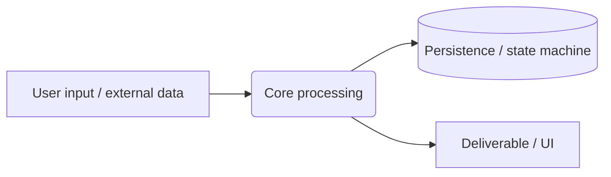

# [Project Name] Core Functional Specification (SPEC.md)

> **Nature of this document**: the single source of truth (SSOT) for this project's business rules.
> **Core principle**: every business-logic change, new feature, or defect fix must **amend this document first**, then write the test, then adjust the implementation. Any behavior diverging from this document is a bug.

<p align="center"><a href="SPEC.md">English</a> · <a href="SPEC.zh-CN.md">简体中文</a></p>

---

## 📌 Progressive spec architecture
- **Monolith phase (light)** — early on (spec under 500 lines), positioning, data flow, and feature contracts all live in this file.
- **Shard phase (grown)** — once complexity rises (spec over 500 lines), split independent sub-domains into `specs/` (e.g. [specs/01_example_module.md](specs/01_example_module.md)) and link them from the module index below, to fight long-context attention decay.

### Module index map
| Module | Spec path | Responsibility | Status |
| :--- | :--- | :--- | :--- |
| **Global** | this file (`SPEC.md`) | Overall architecture, shared data flow, cross-module protocol | Active |
| *[example module]* | `specs/01_example_module.md` | *[sharded sub-domain]* | *Pending* |

---

## 1. Positioning and core value

- **Project name**: [fill in]
- **One-line positioning**: [what core problem this system solves]
- **Target users and core scenarios**:
  - Scenario 1: [primary scenario and expected outcome]
  - Scenario 2: [secondary scenario and expected outcome]
- **Non-functional targets**: [latency, concurrency, footprint, data safety, …]

---

## 2. Architecture and data flow


```mermaid
flowchart LR
    Input[User input / external data] --> Core(Core processing)
    Core --> Storage[(Persistence / state machine)]
    Core --> Output[Deliverable / UI]
```

### Core modules
1. **Input layer**: [what it handles]
2. **Core business layer**: [what it handles]
3. **Output / presentation layer**: [what it handles]

---

## 3. Feature matrix and business rule contracts

### 3.1 Core feature A: [name]
- **Description**: [what it does]
- **Inputs / preconditions**: [what triggers it]
- **Business rules**:
  - Rule 1: [concrete rule]
  - Rule 2: [concrete rule]
- **Expected output / state transition**: [resulting state]

### 3.2 Core feature B: [name]
- **Description**: [what it does]
- **Business rules**:
  - Rule 1: [concrete rule]

---

## 4. Data structures and interface contracts

### 4.1 Core entity
```json
{
  "id": "string (unique identifier)",
  "title": "string (name)",
  "created_at": "string (ISO-8601 timestamp)",
  "status": "pending | processing | completed | failed"
}
```

### 4.2 Interface contract (API / CLI)
| Interface / command | Input | Output | Notes |
| :--- | :--- | :--- | :--- |
| `doSomething(id)` | `{ id: string }` | `{ success: bool }` | Performs the core operation |

---

## 5. Edge cases and boundary defenses

1. **Empty / extreme data**: [expected behavior for empty input, oversized files, illegal characters]
2. **Concurrency / state conflict**: [idempotency when a button is double-clicked or tasks run in parallel]
3. **Network and environment faults**: [graceful fallback on disconnect, timeout, read-only filesystem]

---

## 6. Open-source deliverables baseline

> 💡 **Hard rule**: every open-source project derived from this scaffold must ship the following. Never omit them as minor items.

1. **Sponsorship channels (`SPONSOR.md`)** — provide a standard `SPONSOR.md` at the repository root (see [templates/SPONSOR.md](templates/SPONSOR.md)); cover domestic platforms (WeChat Pay, Alipay, Afdian) and international ones (GitHub Sponsors, Buy Me a Coffee); include fund-transparency notes and a backers wall template.
2. **FAQ and troubleshooting guide (`FAQ.md`)** — provide a standard `FAQ.md` at the repository root (see [templates/FAQ.md](templates/FAQ.md)); cover cross-platform path and encoding problems, common dependency conflicts, and typical error self-service paths.

---

## 7. Localization and visual theming contract

> 💡 **Design red line**: if the project has any user-facing copy or visual surface, localization and theming are **first-class dimensions** (pure non-interactive algorithm libraries are exempt; see [standards/LOCALIZATION.md](standards/LOCALIZATION.md)).

1. **Universal localization rules (any project with user interaction or output)**
   - **Zero raw text**: UI or CLI output must never hardcode natural language; route every string through a dictionary.
   - **No concatenated sentences on the server**: interfaces return structured error codes and metadata (`{"error_code": "...", "params": {...}}`) which the presentation layer translates. Every request carries `Accept-Language`.
   - **Key parity**: the main-language and target-language dictionaries must be 100% mirrored. The gate physically blocks any missing translation.
   - **Layout elasticity**: any project with a view must budget **30%–50%** horizontal headroom. Never hardcode pixel widths that make translated text wrap or explode.
2. **Light/dark mode and design tokens (only for GUI/Web/mobile projects)**
   - **Single source of truth**: manage `light` | `dark` | `system` in one place, persist it, and dispatch it to the root render container.
   - **Semantic design tokens**: never write raw color values; define everything through semantic variables that adapt automatically.
   - **Zero FOUC**: Web/DOM environments must inline an early theme-injection script at the entry point so nothing flickers before render.
