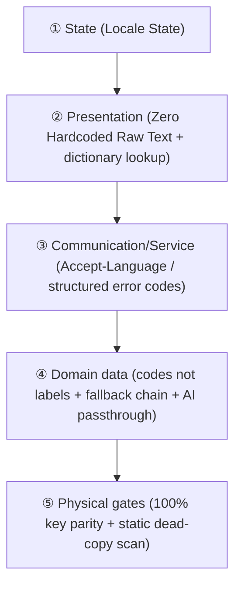

# Full-Lifecycle Localization & Theming (LOCALIZATION.md)

> 💡 **Core philosophy**: localization (i18n) and theming are not "patches applied at render time" — they are **first-class dimensions** running through human interaction, the data flow, service contracts, and CI gates.
> This document defines a **universal cross-stack core model** plus opt-in adapters for Web / mobile / CLI / backend. Pure algorithm libraries and non-interactive components are exempt.

<p align="center"><a href="LOCALIZATION.md">English</a> · <a href="LOCALIZATION.zh-CN.md">简体中文</a></p>

---

## 0. Why retrofit is the default outcome

Every i18n system fails the same way: **the default path produces single-language code, and translation is a second step.** A process that depends on the second step happening is a process that fails.

So the goal is never "remember to localize". The goal is: **a single-language state cannot be expressed, cannot build, and cannot ship.**

That yields five concrete rework sources. Close all five and there is no later rework — not when adding a feature, not when changing one.

| # | Rework source | Why it guarantees rework | What closes it |
|---|---|---|---|
| 1 | A literal string in code | It ships first; the dictionary is an afterthought | **Closed type** (Part 2, layer ①) |
| 2 | A key added to one language only | The gap is invisible until runtime | **Exhaustive type / parity gate** (layers ① and ②) |
| 3 | **Outlets outside the dictionary** — notifications, desktop widgets, server errors, AI output | They bypass UI components, so no UI check can see them | **Pseudo-locale smoke + outlet inventory** (layer ③) |
| 4 | A language baked into persisted data | Switching language splits historical data; **irreversible** | **Codes-only rule** (Part 3) |
| 5 | Layout pinned to one language's length | Text grows 30–50% and the layout bursts | **Pseudo-locale inflation** (layer ③) |

---

## 🌐 Part 1 — The five-layer model

Whatever language or stack a project uses, anything with user-facing output obeys these five layers:



### Layer rules

#### ① State — the language state is a single source of truth
- Global language state (e.g. `zh-CN`, `en-US`) must be held and persisted in **exactly one place**; every consumer derives from it. **No module may read the system locale on its own.**
- A language switch must take effect **immediately and fan out** to every outlet where copy has already been baked into the system (scheduled notifications, an already-rendered desktop widget, cached pages) — not on the next rebuild.
- **Layout elasticity budget**: Latin-script text typically occupies **30%–50%** more horizontal width than Chinese. Never hardcode pixel widths for buttons, inputs, or table headers.

#### ② Presentation — zero raw text
- Every display string is extracted through a translation function or dictionary lookup. Never leave a natural-language literal in business logic.
- Dictionaries are sharded by module; the **main language dictionary is the source of truth** (new keys land there first) and the target languages mirror it.
- **Missing-key degradation**: when a key is absent at runtime, fall back to displaying the key itself (never crash or render blank) and warn in the development environment.

#### ③ Communication/service — language and data are separated
1. **Uniform header** — the client's global HTTP client sends a language header on every request (example format; `q` is the weight):
   ```http
   Accept-Language: zh-CN,en-US;q=0.9
   ```
2. **The backend must never concatenate human-readable sentences**
   - ❌ Absolutely forbidden: `raise HTTPException(detail="user not found or wrong password")`
   - ✅ Required: return a structured error code plus metadata for the presentation layer to translate:
     ```json
     { "error_code": "AUTH_INVALID_CREDENTIALS", "params": { "field": "username" } }
     ```
3. **Dates, times, and money as bare data** — the backend returns ISO-8601 UTC strings or bare values; the presentation layer renders them with the language's standard formatter.

#### ④ Domain data — data carries no language
1. **Persisted enums must be codes** — statuses and types stored in a database must be stable neutral codes (`in_progress`, `approved`, `single_choice`). **Never write a language's copy into a persisted field.** Otherwise a language switch or a cross-device sync produces a language-split history that cannot be repaired.
2. **Content fallback chain** — user-generated or editorially configured multilingual content degrades along `target_locale → default_locale → raw`.
3. **AI prompt passthrough** — every prompt that asks a model to generate text **must pass the user's current `locale`** and force the constraint "Respond strictly in {target_language}" in the system prompt.

#### ⑤ Gates — physical interception, not discipline
- **Key parity gate** — CI diffs the key sets in both directions; anything missing on one side, or any stale key left behind, goes red (implementation in layer ② below).
- **Static dead-copy scan** — a source-scanning guard that catches newly written raw copy (see `TESTING.md` §1.6, the style-as-test triad).

---

## 🛠️ Part 2 — The three enforcement layers

Layers ① and ② are what make this a mechanism rather than an instruction. **Only gates, with no type layer, is discipline. Only a type layer, with no smoke layer, leaks through notifications and widgets forever.**

### Layer ① — Expression: make "untranslated" unrepresentable

**The type of a user-visible string is not `String`.** It is a closed set. UI components accept only that type, so a bare literal cannot be passed in. Adding a string means adding a member, and the compiler then demands a branch for it.

**Dart / Flutter**
```dart
enum AppStr { settingsTitle, todoCountLabel, syncFailed }

extension AppStrL10n on AppStr {
  String tr(AppLocalizations l) => switch (this) {
        AppStr.settingsTitle => l.settings,
        AppStr.todoCountLabel => l.todoCountLabel,
        AppStr.syncFailed => l.syncFailed,
      };
}
```
Adding a member to `AppStr` makes the `switch` non-exhaustive → **compile error** until every string is routed through the dictionary.

> ⚠️ **What this does and does not guarantee.** It guarantees every string goes *through* the dictionary. It does **not** guarantee every language defines it: Flutter's `gen-l10n` silently falls back to the template for a missing translation. So per-language completeness needs layer ② — unless you use a generator that fails instead of falling back.

**TypeScript**
```ts
const en = { settingsTitle: 'Settings', syncFailed: 'Sync failed' } as const;
export type MsgKey = keyof typeof en;
// Missing or extra keys here are a COMPILE error - parity is enforced by the type.
const zh: Record<MsgKey, string> = { settingsTitle: '设置', syncFailed: '同步失败' };
```

**Python**
```python
class Msg(Enum):
    SETTINGS_TITLE = auto()
    SYNC_FAILED = auto()

CATALOG: dict[str, dict[Msg, str]] = {...}

# Import-time: a missing translation refuses to start rather than degrading silently.
for _locale, _table in CATALOG.items():
    _missing = set(Msg) - set(_table)
    if _missing:
        raise RuntimeError(f"{_locale} is missing: {sorted(m.name for m in _missing)}")
```

### Layer ② — Build: gates that catch what the type layer cannot

1. **Key parity, both directions** — missing keys *and* stale keys left behind after a call site is deleted.
2. **Raw-literal scan** — a source-scanning guard per `TESTING.md` §1.6 (`--selftest`, allowlist with WHY, matched by content signature).
3. **Untranslated report must be empty.** Where the generator reports untranslated messages to a file (Flutter's `untranslated-messages-file`), CI asserts that file is empty. **This is the piece that turns "silent fallback" into a red build.**

### Layer ③ — Delivery: pseudo-locale smoke and the outlet inventory

This is the only layer that sees outlet class 3 (notifications, widgets, server errors, AI output), and the only one that sees layout bursting.

**Pseudo-locale recipe**
1. Add a pseudo locale whose every value is the real value **wrapped in markers** and **inflated ~40%**:
   `"Settings"` → `"⟦Şéţţíñĝš················⟧"`.
2. Switch the app to it and walk every screen, triggering native outlets (fire a test notification, refresh the desktop widget).
3. **Any visible text without markers is a string that never went through the dictionary.** Any layout that bursts is source 5.
4. Screenshot the run; the shots are the evidence, and a machine can grep them for markerless text.

**Outlet inventory**
Keep an explicit list of every place user-visible text appears: in-app UI, notifications, desktop/widget, share/export text, server errors surfaced to the user, AI-generated text, CLI output, store listing, permission prompts.

**Rule**: a new outlet must be added to the list *and* covered by the pseudo-locale run. **An outlet that is not on the list is not shippable.**

---

## 🌓 Part 3 — Visual theming (GUI / Web / mobile only)

> 💡 *CLI tools, pure backend microservices, and offline compute jobs are exempt from this part.*

1. **Single source of truth** — manage `light` | `dark` | `system` at the top level, persist it, and dispatch it to the root render container. Every component derives from it; no local overrides.
2. **Semantic design tokens; no raw color values** — never write `#ffffff` or `#000000` in a component. Backgrounds, text, and borders all come from semantic variables (e.g. `surface-primary`, `text-main`) that respond to light/dark automatically. New components adapt by default.
3. **Zero FOUC** — any project with a Web/DOM rendering environment must read the preference and lock the root class before the first paint, so nothing flickers while styles load (executable implementation in Part 4, Web adapter).

---

## 🔌 Part 4 — Per-stack adapters (opt-in)

### 1. Web frontend (Vue / React / Svelte / plain DOM)
- **Extraction**: `t('module.key')`;
- **Document language tag**: the language state must be synced live to the root document attribute (`<html lang="zh-CN">`) for screen readers and search engines;
- **Anti-flicker implementation**: inline a zero-dependency script in the entry `<head>` that locks the theme before first paint:
  ```html
  <script>
    (function() {
      try {
        var t = localStorage.getItem('app_theme') || (window.matchMedia('(prefers-color-scheme: dark)').matches ? 'dark' : 'light');
        if (t === 'dark') document.documentElement.classList.add('dark');
      } catch (e) {}
    })();
  </script>
  ```
- **Static scan gate**: Vue projects should enable `eslint-plugin-vue-i18n` with `no-raw-text: error` (covering the `title` / `placeholder` / `aria-label` / `alt` attributes); React projects `eslint-plugin-i18next`; or write your own source-scanning test.

### 2. Mobile and cross-platform GUI (Flutter / React Native / SwiftUI / Compose)
- **Extraction**: use the platform standard (Flutter `flutter gen-l10n` + ARB, RN `i18next`, Apple String Catalogs, Android `strings.xml`);
- **Key parity gate**: main and target dictionaries must mirror. Flutter, for example, can emit a missing-translation report via `untranslated-messages-file`, and CI asserts that file is empty;
- **System-level outlets**: notifications, desktop widgets, and shortcuts are outlets where copy has already been baked into the OS. They must be **re-pushed on a language switch**, otherwise they keep showing the old language;
- **Native resources**: platform-side string resources (notification channel names, app name, permission prompts, widget descriptions) need a per-language copy. Never ship only the main language.

### 3. CLI projects (Python / Go / Rust / Node CLI)
- **Parameter control**: support a `--lang [zh|en]` flag and read the `LANG` environment variable;
- **Output**: all console output goes through an internal i18n catalog. Never `print("Chinese error")` inside an execution function.

### 4. Backend and API projects (FastAPI / Spring / Express / Gin)
- **Header detection**: a global middleware parses the HTTP `Accept-Language` header;
- **Exception contract**: throw error-code objects derived from a structured exception base class. Never return a raw human-readable string.
