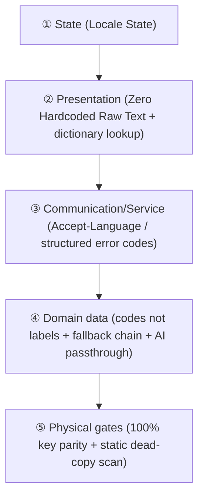

# Full-Lifecycle Localization & Visual Theming Architecture (LOCALIZATION.md)

> 💡 **Core philosophy**: localization (i18n) and theming are not "patches applied at render time" — they are **first-class dimensions** running through human interaction, the data flow, service contracts, and CI gates.
> Any localization scheme that relies on developers or AI "remembering to comply" will rot. It must be held up by **physical interception and type constraints in the toolchain**.
> This document defines a **universal cross-stack core model** plus opt-in adapters for Web / mobile / CLI / backend. Pure algorithm libraries and non-interactive components are exempt.

<p align="center"><a href="LOCALIZATION.md">English</a> · <a href="LOCALIZATION.zh-CN.md">简体中文</a></p>

---

## 🌐 Part 1 — The universal five-layer localization model

Whatever language or stack a project uses, anything with user-facing output obeys these five layers:



### 1. Universal core rules (100% cross-language, cross-stack)

1. **Zero hardcoded natural language** — never scatter human-readable strings through core business logic; every prompt and UI string goes through a modular dictionary or language pack (per-stack formats in Part 3).
2. **Servers must never concatenate human sentences** — interface errors return a structured code plus parameters: `{"error_code": "RESOURCE_NOT_FOUND", "params": {"id": 123}}`, translated by the presentation layer. This eliminates the front-end/back-end language split.
3. **Key parity gate** — the main language and every target language must have identical key sets. Any new or missing key is intercepted by an automated test.
4. **Bare data only** — time is always returned as ISO-8601 UTC; numbers and money as bare values. The presentation layer renders them with the environment's standard localization formatter (JavaScript `Intl`, Python `babel`, Dart `intl`, Rust `fluent`).

### 2. Layer-by-layer rules

#### ① State — the language state is a single source of truth
- Global language state (e.g. `zh-CN`, `en-US`) must be held and persisted in **exactly one place**; every consumer derives from it. **No module may read the system locale on its own.**
- A language switch must take effect **immediately and fan out** to every outlet where copy has already been baked into the system (scheduled notifications, an already-rendered desktop widget, cached pages) — not on the next rebuild.
- **Layout elasticity budget**: Latin-script text typically occupies **30%–50%** more horizontal width than Chinese. Never hardcode pixel widths for buttons, inputs, or table headers; provide fluid elasticity and wrapping/ellipsis tolerance.

#### ② Presentation — zero raw text
- Every display string is extracted through a translation function or dictionary lookup. Never leave a natural-language literal in business logic.
- Dictionaries are sharded by module; the **main language dictionary is the source of truth** (new keys land there first) and the target languages mirror it.
- **Missing-key degradation**: when a key is absent at runtime, fall back to displaying the key itself (never crash or render blank) and warn in the development environment — so a missing translation surfaces during development rather than after release.

#### ③ Communication/service — language and data are separated
1. **Uniform header** — the client's global HTTP client must send a language header on every request (example format; `q` is the weight):
   ```http
   Accept-Language: zh-CN,en-US;q=0.9
   ```
2. **The backend must never concatenate human-readable sentences**
   - ❌ Absolutely forbidden: `raise HTTPException(detail="user not found or wrong password")`
   - ✅ Required: return a structured error code plus metadata for the presentation layer to translate:
     ```json
     { "error_code": "AUTH_INVALID_CREDENTIALS", "params": { "field": "username" } }
     ```
   - This is what prevents the disaster of "the UI switched to English and the error dialog is still Chinese".
3. **Dates, times, and money as bare data** — the backend returns ISO-8601 UTC strings or bare values; the presentation layer renders them with the language's standard formatter.

#### ④ Domain data — data carries no language
1. **Persisted enums must be codes** — statuses and types stored in a database must be stable neutral codes (`in_progress`, `approved`, `single_choice`). **Never write a language's copy into a persisted field**; the presentation layer translates at display time. Otherwise a language switch or a cross-device sync produces a language-split history.
2. **Content fallback chain** — user-generated or editorially configured multilingual content degrades along `target_locale → default_locale → raw`, so a missing ring still yields a value instead of a blank.
3. **AI prompt passthrough** — every prompt that asks a model to generate text **must pass the user's current `locale`** and force the constraint "Respond strictly in {target_language}" in the system prompt. Otherwise you get "the UI is English but the AI still answers in Chinese".

#### ⑤ Gates — physical interception, not discipline
- **Key parity gate** — CI diffs the key sets in both directions; anything missing on one side, or any stale key left behind, goes red. The assertion logic is stack-independent:
  ```python
  def test_locale_keys_parity():
      base = extract_all_keys(BASE_LOCALE)          # parse the main dictionary file by file
      for lang in OTHER_LOCALES:
          other = extract_all_keys(lang)
          assert not (base - other), f"{lang} missing keys: {base - other}"
          assert not (other - base), f"{lang} stale keys: {other - base}"
  ```
- **Static dead-copy scan** — write a source-scanning guard that catches newly written raw copy (see `standards/TESTING.md` §1.6, the style-as-test triad). A project whose main language is Chinese can scan for a CJK regex; a main-language-English project should scan for "string literals not wrapped in the lookup function". **Whatever you scan, the guard must first prove it can go red and green.**

---

## 🌓 Part 2 — Visual theming (GUI / Web / mobile only)

> 💡 *CLI tools, pure backend microservices, and offline compute jobs are exempt from this part.*

1. **Single source of truth** — manage `light` | `dark` | `system` at the top level, persist it, and dispatch it to the root render container. Every component derives from it; no local overrides.
2. **Semantic design tokens; no raw color values** — never write `#ffffff` or `#000000` in a component. Backgrounds, text, and borders all come from semantic variables (e.g. `surface-primary`, `text-main`) that respond to light/dark automatically. New components adapt by default.
3. **Zero FOUC** — any project with a Web/DOM rendering environment must read the preference and lock the root class before the first paint, so nothing flickers while styles load (executable implementation in Part 3, Web adapter).

---

## 🛠️ Part 3 — Per-stack adapters (opt-in)

### 1. Web frontend (Vue / React / Svelte / plain DOM)
- **Extraction**: `t('module.key')`;
- **Document language tag**: the language state must be synced live to the root document attribute (`<html lang="zh-CN">`) for screen readers and search engines;
- **Anti-flicker implementation**: inline a zero-dependency script in the entry `<head>` that locks the theme before first paint:
  ```html
  <script>
    (function() {
      try {
        var t = localStorage.getItem('app_theme') || (window.matchMedia('(prefers-color-scheme: dark)').matches ? 'dark' : 'light');
        if (t === 'dark') document.documentElement.classList.add('dark');
      } catch (e) {}
    })();
  </script>
  ```
- **Static scan gate**: Vue projects should enable `eslint-plugin-vue-i18n` with `no-raw-text: error` (covering the `title` / `placeholder` / `aria-label` / `alt` attributes); React projects `eslint-plugin-i18next`; or write your own source-scanning test.

### 2. Mobile and cross-platform GUI (Flutter / React Native / SwiftUI / Compose)
- **Extraction**: use the platform standard (Flutter `flutter gen-l10n` + ARB, RN `i18next`, Apple String Catalogs, Android `strings.xml`);
- **Key parity gate**: main and target dictionaries must mirror. Flutter, for example, can emit a missing-translation report via `untranslated-messages-file`, and CI asserts that file is empty;
- **System-level outlets**: notifications, desktop widgets, and shortcuts are outlets where copy has already been baked into the OS. They must be **re-pushed on a language switch**, otherwise they keep showing the old language;
- **Native resources**: platform-side string resources (notification channel names, app name, permission prompts, widget descriptions) need a per-language copy. Never ship only the main language.

### 3. CLI projects (Python / Go / Rust / Node CLI)
- **Parameter control**: support a `--lang [zh|en]` flag and read the `LANG` environment variable;
- **Output**: all console output goes through an internal i18n catalog. Never `print("Chinese error")` inside an execution function.

### 4. Backend and API projects (FastAPI / Spring / Express / Gin)
- **Header detection**: a global middleware parses the HTTP `Accept-Language` header;
- **Exception contract**: throw error-code objects derived from a structured exception base class. Never return a raw human-readable string.
