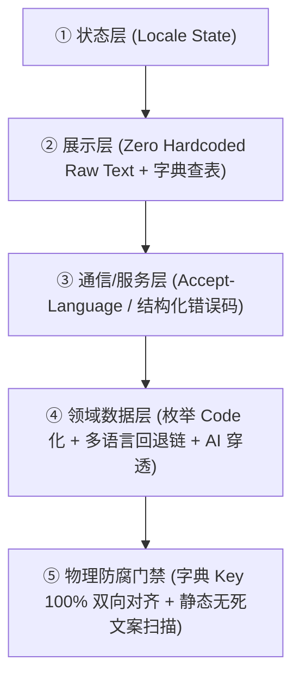

# 全生命周期本地化与视觉主题工程架构规约 (LOCALIZATION.md)

> 💡 **核心哲学**：本地化（i18n）与主题（Theme）不是渲染期的"局部补丁"，而是贯穿人机交互、数据流、服务契约与 CI 门禁的**一等公民（First-Class Dimension）**。
> 本规约定义**通用跨栈核心模型**，并提供针对 Web / 移动端 / CLI / 后端的按需适配器。纯算法库或无交互组件自动豁免。

<p align="center"><a href="LOCALIZATION.zh-CN.md">简体中文</a> · <a href="LOCALIZATION.md">English</a></p>

---

## 0. 为什么"事后补国际化"才是默认结局

所有 i18n 体系的失败方式都一样：**默认路径产出的是单语言代码，翻译是第二步。** 而一个依赖"第二步会发生"的流程，就是一个注定失败的流程。

所以目标从来不是"记得做本地化"，而是：**让单语言状态无法被表达、无法通过构建、无法通过交付。**

由此得出五个具体的返工源。五个全堵住，后面就不会再返工——加功能不会，改功能也不会。

| # | 返工源 | 为什么它必然导致返工 | 用什么关掉它 |
|---|---|---|---|
| 1 | 代码里写了字面量 | 它先上线，字典是后来的事 | **封闭类型**（第二部分 ①） |
| 2 | 只给一种语言加了 key | 缺口在运行期才可见 | **穷尽类型 / 键对齐门禁**（① 与 ②） |
| 3 | **字典之外的出口**——通知、桌面小组件、服务端错误、AI 输出 | 它们不走 UI 组件，任何"检查 UI"的手段都看不见 | **伪语言冒烟 + 出口清单**（③） |
| 4 | 数据里存了某一语言的文案 | 切语言时历史数据语言撕裂，**不可逆** | **枚举 code 化**（第三部分） |
| 5 | 排版按主语言长度定死 | 换个语言文案涨 30–50%，布局当场爆裂 | **伪语言膨胀**（③） |

---

## 🌐 第一部分 — 五层模型

无论什么语言、什么技术栈，只要存在面向用户的输出，都遵循这五层：



### 分层规约

#### ① 状态层——语言状态是单一真理源
- 全局语言状态（如 `zh-CN`、`en-US`）必须由**唯一一处**持有并持久化，所有消费端从它派生，**禁止各模块自行读系统语言**；
- 语言切换必须**即时生效并扇出**到所有"文案已被烘焙进系统"的出口（已排期的通知、已渲染的桌面小组件、缓存的页面），而不是等下次重建；
- **排版弹性预算**：拉丁语系文字通常比中文多占 **30%~50%** 水平宽度，禁止把按钮、输入框、表头宽度硬编码成固定像素。

#### ② 展示层——零裸文本
- 所有展示文案必须通过翻译函数或字典查表提取，**严禁在业务逻辑里散落自然语言**；
- 字典按模块分片，**主语言字典是真理源**（新 key 先落主语言），目标语言与之镜像；
- **缺 key 降级**：运行期缺 key 时回退显示 key 本身（不崩溃、不空白），并在开发环境输出警告。

#### ③ 通信/服务层——语言与数据分离
1. **统一标头**：客户端全局 HTTP Client 在每次请求携带语言标头（示例格式，`q` 为权重）：
   ```http
   Accept-Language: zh-CN,en-US;q=0.9
   ```
2. **后端严禁拼接面向人类的自然语言句子**
   - ❌ **绝对禁止**：`raise HTTPException(detail="用户不存在或密码错误")`
   - ✅ **强制要求**：返回结构化错误码与元数据，由展示层查表翻译：
     ```json
     { "error_code": "AUTH_INVALID_CREDENTIALS", "params": { "field": "username" } }
     ```
3. **日期/时间/货币裸数据化**：后端返回 ISO-8601 UTC 字符串或纯数值，展示层用该语言的标准格式化工具渲染。

#### ④ 领域数据层——数据不带语言
1. **系统枚举入库必须 Code 化**：数据库里存的状态、类型必须是稳定中性 code（`in_progress`、`approved`、`single_choice`），**严禁向持久化字段写任何语言的文案**；否则切语言或跨端同步时，历史数据语言撕裂且**改不回来**。
2. **内容多语言降级链**：用户产出或运营配置的多语言内容，按 `target_locale → default_locale → raw` 降级展示。
3. **AI 提示词穿透**：所有让模型生成文本的 Prompt **必须透传用户当前 `locale`**，并在 System Prompt 强制约束 "Respond strictly in {target_language}"。

#### ⑤ 门禁层——物理拦截，不靠自觉
- **键对齐门禁**：CI 双向比对字典键集，任一方向缺键或残留废弃键即红灯（实现见第二部分 ②）；
- **静态无死文案扫描**：一条源码扫描守卫，拦截新写的裸文案（三件套见 `TESTING.md` §一.6「规范即测试」）。

---

## 🛠️ 第二部分 — 三层强制机制

① 与 ② 是让这件事从"要求"变成"机制"的部分。**只有门禁没有类型层，是自觉；只有类型层没有冒烟层，通知和小组件会漏一辈子。**

### ① 表达层——让"未翻译"在类型上无法表达

**用户可见字符串的类型不是 `String`，而是一个封闭集合。** UI 组件只接受这个类型，裸字面量传不进去。加一条文案 = 加一个成员，编译器随即要求为它写一个分支。

**Dart / Flutter**
```dart
enum AppStr { settingsTitle, todoCountLabel, syncFailed }

extension AppStrL10n on AppStr {
  String tr(AppLocalizations l) => switch (this) {
        AppStr.settingsTitle => l.settings,
        AppStr.todoCountLabel => l.todoCountLabel,
        AppStr.syncFailed => l.syncFailed,
      };
}
```
给 `AppStr` 加一个成员，这个 `switch` 立刻不再穷尽 → **编译错误**，直到每条文案都走字典为止。

> ⚠️ **它保证了什么、没保证什么。** 它保证每条文案都**经过**字典；它**不**保证每种语言都定义了这条——Flutter 的 `gen-l10n` 对缺失翻译会**静默回退**到模板。所以"每个语言都补齐"要靠第二层，除非你换用"缺失即失败"的生成器。

**TypeScript**
```ts
const en = { settingsTitle: 'Settings', syncFailed: 'Sync failed' } as const;
export type MsgKey = keyof typeof en;
// 这里缺键或多键都是编译错误——键对齐由类型保证。
const zh: Record<MsgKey, string> = { settingsTitle: '设置', syncFailed: '同步失败' };
```

**Python**
```python
class Msg(Enum):
    SETTINGS_TITLE = auto()
    SYNC_FAILED = auto()

CATALOG: dict[str, dict[Msg, str]] = {...}

# 导入期即校验：缺翻译就拒绝启动，而不是静默降级。
for _locale, _table in CATALOG.items():
    _missing = set(Msg) - set(_table)
    if _missing:
        raise RuntimeError(f"{_locale} is missing: {sorted(m.name for m in _missing)}")
```

### ② 构建层——补上类型层看不见的地方

1. **键对齐，双向**——既查漏译，也查删掉调用点后残留的废弃 key；
2. **裸文案扫描**——按 `TESTING.md` §一.6 写一条源码扫描守卫（`--selftest`、白名单写 WHY、按内容签名匹配）；
3. **未翻译清单必须为空**——生成器把未翻译项写进文件时（Flutter 的 `untranslated-messages-file`），CI 断言该文件为空。**这一条才是把"静默回退"变成"构建变红"的关键。**

### ③ 交付层——伪语言冒烟与出口清单

这是唯一能看见第 3 类出口（通知、组件、服务端错误、AI 输出）的一层，也是唯一能看见第 5 类排版爆裂的一层。

**伪语言配方**
1. 加一个伪语言，它的每个值都是真实值**套上标记**并**膨胀约 40%**：
   `"设置"` → `"⟦Ŝèţţíñĝ················⟧"`；
2. 把 App 切到它，走遍每个界面，并触发原生出口（发一条测试通知、刷新一次桌面小组件）；
3. **屏幕上任何没带标记的文字，就是没走字典的漏网之鱼**；任何爆掉的布局，就是第 5 类返工源；
4. 把这一趟截图存档。截图就是证据，而且机器可以扫图上有没有无标记文字。

**出口清单**
维护一份显式清单，列出所有会出现用户可见文字的地方：应用内 UI、通知、桌面/小组件、分享与导出文本、透传给用户的服务端错误、AI 生成文本、CLI 输出、应用商店文案、权限弹窗。

**规矩**：新增一个出口，必须同时**登记进清单**并**被伪语言跑覆盖**。**不在清单上的出口，不允许发。**

---

## 🌓 第三部分：视觉主题法则（仅适用于 GUI / Web / 移动端）

> 💡 *注：命令行 CLI 工具、纯后端微服务、离线计算任务自动豁免本部分。*

1. **单一真理源**：统一由顶层管理 `light` | `dark` | `system` 三种状态，持久化并派发给根渲染容器；所有组件从它派生，禁止局部私设；
2. **语义化 Design Tokens，严禁裸写固定色值**：界面组件严禁写死 `#ffffff`、`#000000`；所有背景、文字、边框必须通过语义变量（如 `surface-primary`, `text-main`）定义，自动响应日夜切换，新写组件默认自适应；
3. **零闪烁白屏防御 (Zero FOUC)**：具有 Web / DOM 渲染环境的工程，必须在首屏渲染前尽早读取偏好并锁定根类名，杜绝样式渲染延迟导致的闪烁（可执行实现见第四部分 Web 适配器）。

---

## 🔌 第四部分：分端适配器指引（按需选用）

### 1. Web 前端适配（Vue / React / Svelte / 原生 DOM）
- **文案提取**：`t('module.key')`；
- **文档语言标记**：语言状态必须实时同步到根文档属性（`<html lang="zh-CN">`），供屏幕阅读器与搜索引擎识别；
- **防闪烁实现**：在入口 `<head>` 内联零依赖脚本，首屏渲染前完成主题锁定：
  ```html
  <script>
    (function() {
      try {
        var t = localStorage.getItem('app_theme') || (window.matchMedia('(prefers-color-scheme: dark)').matches ? 'dark' : 'light');
        if (t === 'dark') document.documentElement.classList.add('dark');
      } catch (e) {}
    })();
  </script>
  ```
- **静态扫描门禁**：Vue 推荐 `eslint-plugin-vue-i18n` 的 `no-raw-text: error`（属性覆盖 `title` / `placeholder` / `aria-label` / `alt`）；React 推荐 `eslint-plugin-i18next`；亦可自写源码扫描测试。

### 2. 移动端与跨平台 GUI 适配（Flutter / React Native / SwiftUI / Compose）
- **文案提取**：走平台标准方案（Flutter `flutter gen-l10n` + ARB、RN `i18next`、Apple `String Catalog`、Android `strings.xml`）；
- **字典键对齐门禁**：主语言与目标语言字典键集必须镜像；例如 Flutter 可用 `untranslated-messages-file` 输出漏译清单，再由 CI 断言该文件为空；
- **系统级出口**：通知、桌面小组件、快捷指令等“文案已被烘焙进系统”的出口，必须在语言切换时**重新下发**，否则会一直显示旧语言；
- **原生资源**：平台侧字符串资源（通知渠道名、应用名、权限说明、小组件描述）需按语言分别提供，不能只给主语言一份。

### 3. CLI 命令行项目适配（Python / Go / Rust / Node CLI）
- **参数控制**：统一支持 `--lang [zh|en]` 参数及读取 `LANG` 环境变量；
- **输出格式**：控制台输出统一通过内部国际化 catalog 格式化打印，严禁在执行函数中 `print("中文错误")`。

### 4. 纯后端与 API 项目适配（FastAPI / Spring / Express / Gin）
- **标头识别**：全局中间件解析 HTTP `Accept-Language` 标头；
- **异常契约**：统一抛出继承自结构化异常基类的错误码对象，严禁直接返回面向人类的纯字符串。
