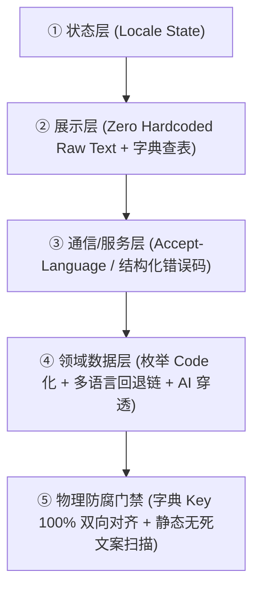

# 全生命周期本地化与视觉主题工程架构规约 (Localization & Theme Architecture)

> 💡 **核心哲学**：本地化（i18n）与主题（Theme）不是渲染期的“局部补丁”，而是贯穿人机交互、数据流、服务契约与 CI 门禁的**一等公民（First-Class Dimension）**。
> 任何依赖开发者或 AI“自觉遵守”的本地化体系终将退化腐烂，必须依靠**工具链的物理拦截与类型约束**确保一劳永逸。
> 本规约定义**通用跨栈核心模型**，并提供针对 Web / 移动端 / CLI / 后端服务的按需适配器。纯算法库或无交互组件自动豁免。

---

## 🌐 第一部分：通用本地化五层模型 (Universal Localization Model)

无论项目采用何种语言或技术栈，只要存在用户交互输出，均遵循以下 5 层契约：



### 1. 通用核心法则（跨语言、跨技术栈 100% 通用）
1. **零硬编码自然语言 (Zero Hardcoded Raw Strings)**：核心业务逻辑中**严禁散落面向人类的硬编码自然语言**；所有提示文案、界面文本必须通过模块化字典或语言包管理（各栈的字典格式与目录约定见第三部分适配器）；
2. **服务端/后端严禁拼接人类自然语言**：接口错误与提示必须返回结构化状态码与参数：`{"error_code": "RESOURCE_NOT_FOUND", "params": {"id": 123}}`，由展示层查字典翻译，杜绝前后端语言撕裂；
3. **字典键双向 100% 对齐门禁 (Key Parity)**：主语言与所有目标语言的字典键集必须完全一致，任何新增或漏译必须被自动化测试拦截阻断；
4. **纯裸数据传递**：时间一律返回标准 ISO-8601 UTC，数字与货币返回纯数值，由展示层调用各环境标准的本地化格式化工具（如 JavaScript `Intl`、Python `babel`、Dart `intl`、Rust `fluent`）渲染。

### 2. 五层逐层规约

#### ① 状态层：语言状态是单一真理源
- 全局语言状态（如 `zh-CN`、`en-US`）必须由**唯一一处**持有并持久化，所有消费端从它派生，**禁止各模块自行去读系统语言**；
- 语言切换必须**即时生效并扇出**到所有“文案已被烘焙进系统”的出口（如已排期的通知、已渲染的桌面小组件、缓存的页面），而不是等下次重建才更新；
- **排版弹性预算**：拉丁语系文字通常比中文多占用 **30%~50%** 水平宽度，禁止将按钮、输入框、表头宽度硬编码为固定像素；必须具备流式弹性与折行/省略容错。

#### ② 展示层：零裸文本
- 所有展示文案必须统一通过翻译函数或字典查表提取，**严禁在业务逻辑中散落自然语言**；
- 字典按模块分片组织，**主语言字典为真理源**（新增 key 先落主语言），目标语言字典与之镜像；
- **缺失降级策略**：运行时缺 key 时降级回退显示 key 本身（而非崩溃或空白），并在开发环境输出警告，让漏译在开发期就暴露，而不是上线后才发现。

#### ③ 通信/服务层：语言与数据分离
1. **统一标头**：客户端全局 HTTP Client 在发起每个请求时，必须携带语言标头（示例格式，`q` 为权重）：
   ```http
   Accept-Language: zh-CN,en-US;q=0.9
   ```
2. **后端严禁拼接面向人类的自然语言句子！**
   - ❌ **绝对禁止**：`raise HTTPException(detail="用户不存在或密码错误")`
   - ✅ **强制要求**：返回结构化错误码与元数据参数，由展示层查表翻译：
     ```json
     { "error_code": "AUTH_INVALID_CREDENTIALS", "params": { "field": "username" } }
     ```
   - 这从根本上杜绝了“前端切了英文，后端报错弹窗全出中文”的灾难；
3. **日期/时间/货币裸数据化**：后端统一返回标准 ISO-8601 UTC 字符串或纯数值，由展示层用各语言标准的本地化格式化工具渲染。

#### ④ 领域数据层：数据不带语言
1. **系统枚举入库必须 Code 化**：数据库中存储的状态、类型必须是稳定的中性 code（如 `in_progress`、`approved`、`single_choice`），**严禁向持久化字段写入某一语言的文案**；展示时由展示层查字典翻译。否则一旦切换语言或跨端同步，历史数据就会出现语言撕裂；
2. **内容多语言降级链 (Fallback Chain)**：用户产出或运营配置的多语言内容，按 `target_locale → default_locale → raw` 链路降级展示，任一环缺失都能取到兜底值，而不是显示空白；
3. **AI 提示词穿透**：所有调用大模型生成文本的 Prompt 中，**必须把用户当前 `locale` 作为入参透传**，并在 System Prompt 中强制约束 “Respond strictly in {target_language}”。否则会出现“界面切成英文、AI 仍然用中文回答”的撕裂。

#### ⑤ 门禁层：物理拦截，不靠自觉
- **Key Parity 门禁**：CI 中运行字典键集双向比对，任何一侧缺失或残留废弃键即红灯。断言逻辑与具体技术栈无关：
  ```python
  def test_locale_keys_parity():
      base = extract_all_keys(BASE_LOCALE)          # 逐文件解析主语言字典
      for lang in OTHER_LOCALES:
          other = extract_all_keys(lang)
          assert not (base - other), f"{lang} 漏译键: {base - other}"
          assert not (other - base), f"{lang} 残留废弃键: {other - base}"
  ```
- **静态无死文案扫描**：用一条源码扫描守卫拦截新写的裸文案（三件套见 `TESTING.md` §一.5「规范即测试」）。主语言为中文的项目可直接扫汉字正则；主语言为英文的项目应扫“未被查表函数包裹的字符串字面量”。**无论扫什么，守卫都必须先自证能红能绿。**

---

## 🌓 第二部分：视觉主题法则（仅适用于 GUI / Web / 移动端）

> 💡 *注：命令行 CLI 工具、纯后端微服务、离线计算任务自动豁免本部分。*

1. **单一真理源**：统一由顶层管理 `light` | `dark` | `system` 三种状态，持久化并派发给根渲染容器；所有组件从它派生，禁止局部私设；
2. **语义化 Design Tokens，严禁裸写固定色值**：界面组件严禁写死 `#ffffff`、`#000000`；所有背景、文字、边框必须通过语义变量（如 `surface-primary`, `text-main`）定义，自动响应日夜切换，新写组件默认自适应；
3. **零闪烁白屏防御 (Zero FOUC)**：具有 Web / DOM 渲染环境的工程，必须在首屏渲染前尽早读取偏好并锁定根类名，杜绝样式渲染延迟导致的闪烁（可执行实现见第三部分 Web 适配器）。

---

## 🛠️ 第三部分：分端适配器指引（按需选用）

### 1. Web 前端适配（Vue / React / Svelte / 原生 DOM）
- **文案提取**：`t('module.key')`；
- **文档语言标记**：语言状态必须实时同步到根文档属性（`<html lang="zh-CN">`），供屏幕阅读器与搜索引擎识别；
- **防闪烁实现**：在入口 `<head>` 内联零依赖脚本，首屏渲染前完成主题锁定：
  ```html
  <script>
    (function() {
      try {
        var t = localStorage.getItem('app_theme') || (window.matchMedia('(prefers-color-scheme: dark)').matches ? 'dark' : 'light');
        if (t === 'dark') document.documentElement.classList.add('dark');
      } catch (e) {}
    })();
  </script>
  ```
- **静态扫描门禁**：Vue 推荐 `eslint-plugin-vue-i18n` 的 `no-raw-text: error`（属性覆盖 `title` / `placeholder` / `aria-label` / `alt`）；React 推荐 `eslint-plugin-i18next`；亦可自写源码扫描测试。

### 2. 移动端与跨平台 GUI 适配（Flutter / React Native / SwiftUI / Compose）
- **文案提取**：走平台标准方案（Flutter `flutter gen-l10n` + ARB、RN `i18next`、Apple `String Catalog`、Android `strings.xml`）；
- **字典键对齐门禁**：主语言与目标语言字典键集必须镜像；例如 Flutter 可用 `untranslated-messages-file` 输出漏译清单，再由 CI 断言该文件为空；
- **系统级出口**：通知、桌面小组件、快捷指令等“文案已被烘焙进系统”的出口，必须在语言切换时**重新下发**，否则会一直显示旧语言；
- **原生资源**：平台侧字符串资源（通知渠道名、应用名、权限说明、小组件描述）需按语言分别提供，不能只给主语言一份。

### 3. CLI 命令行项目适配（Python / Go / Rust / Node CLI）
- **参数控制**：统一支持 `--lang [zh|en]` 参数及读取 `LANG` 环境变量；
- **输出格式**：控制台输出统一通过内部国际化 catalog 格式化打印，严禁在执行函数中 `print("中文错误")`。

### 4. 纯后端与 API 项目适配（FastAPI / Spring / Express / Gin）
- **标头识别**：全局中间件解析 HTTP `Accept-Language` 标头；
- **异常契约**：统一抛出继承自结构化异常基类的错误码对象，严禁直接返回面向人类的纯字符串。
