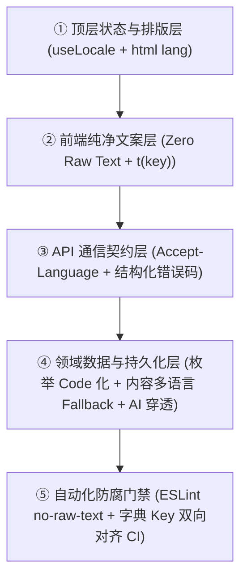

# 全生命周期全双语与主题设计工程法则 (I18N & Theme Architecture)

> 💡 **核心哲学**：双语（i18n）与主题（Theme）不是渲染期的“字符串翻译表”或“局部样式补丁”，而是贯穿全栈数据流、API 契约、状态管理与 CI 门禁的**一等公民（First-Class Dimension）**。
> 任何依赖开发者或 AI “自觉遵守”的双语体系终将退化腐烂，必须依靠**开源工具链的物理拦截与类型约束**确保一劳永逸。

---

## 🌓 第一部分：日夜主题切换法则 (Theme Architecture)

### 1. 三大约束原则
1. **单一真理源 (Single Source of Truth)**：
   - 全局支持 `light` | `dark` | `system` 三种状态，由单例 Composable / Store 统一管理；
   - 偏好自动同步至持久化存储（`localStorage`）并派发给根节点（`<html class="dark">` 或 `data-theme` 属性）。
2. **语义化 Design Token，严禁裸写固定颜色**：
   - 严禁在组件模板中裸写 `#ffffff`、`#1e1e1e` 或非语义类名 `bg-white`；
   - 必须通过 CSS 变量或 Tailwind 语义化 Token（如 `bg-surface-primary`, `text-primary`, `border-muted`）定义。深色适配应由全局变量自动响应，新写组件默认自适应。
3. **零闪烁白屏防御 (Zero FOUC - Flash of Unstyled Content)**：
   - 在 SPA 入口页面的 `<head>` 中必须内联极简脚本：
   ```html
   <script>
     (function() {
       try {
         var t = localStorage.getItem('app_theme') || (window.matchMedia('(prefers-color-scheme: dark)').matches ? 'dark' : 'light');
         if (t === 'dark') document.documentElement.classList.add('dark');
       } catch (e) {}
     })();
   </script>
   ```

---

## 🌐 第二部分：全双语五层穿透法则 (i18n Architecture)

### 1. 五层穿透架构模型


### 2. 逐层设计规约

#### ① 顶层状态与排版层
- 语言状态（如 `zh-CN`, `en-US`）必须实时同步至 `<html lang="zh-CN">`；
- **排版防御预算**：英语等拉丁语系文字通常比中文多占用 30%~50% 水平宽度，禁止将按钮、输入框、表头宽度硬编码为固定像素；必须具备流式弹性与折行/省略容错。

#### ② 前端纯净文案层
- 前端页面**严禁裸写任何自然语言字符串**；
- 所有展示文案必须统一通过翻译函数 `t('module.entity.action')` 提取；
- 语言包推荐采用模块化 JSON 字典组织：
  - `locales/zh-CN.json`（主语言真理源）
  - `locales/en-US.json`（目标语言真理源）
- 若运行时缺少对应 key，降级回退显示 key 本身，并在开发环境输出警告。

#### ③ API 契约层（核心防返工红线）
1. **统一标头**：前端全局 HTTP Client（Axios / Fetch / Ky）在发起每个请求时必须携带标头：
   ```http
   Accept-Language: zh-CN,en-US;q=0.9
   ```
2. **后端严禁拼接面向人类的自然语言句子！**
   - ❌ **绝对禁止**：`raise HTTPException(detail="用户不存在或密码错误")`
   - ✅ **强制要求**：返回结构化错误码与元数据参数：
     ```json
     {
       "error_code": "AUTH_INVALID_CREDENTIALS",
       "message": "Invalid username or password",
       "params": { "field": "username" }
     }
     ```
   - 页面由前端根据 `error_code` 在字典中查表翻译展示。这从根本上杜绝了“前端切了英文，后端报错弹窗全出中文”的灾难。
3. **日期/时间/货币裸数据化**：后端统一返回标准 ISO-8601 UTC 字符串或纯数值，前端统一使用 `Intl.DateTimeFormat` / `Intl.NumberFormat` 进行本地化渲染。

#### ④ 领域数据与 AI 层
- **系统枚举入库**：数据库中存储的状态、类型必须是英文 code（如 `in_progress`, `approved`, `single_choice`），严禁向持久化字段写入中文枚举；
- **内容多语言降级链 (Fallback Chain)**：业务内容（如商品名称、文章标题）按 `target_locale -> default_locale -> raw` 链路降级展示；
- **AI 提示词穿透**：所有调用大模型生成文本的 Prompt 中，必须将用户当前的 `locale` 作为入参透传，并在 System Prompt 强制要求：“Respond strictly in {target_language}”。

---

## 🛡️ 第三部分：工具链物理强制（开源武器库）

依靠人脑自觉必将失败，必须在项目中配置自动化物理门禁：

### 1. Vue/前端：ESLint 拦截裸文字
在前端 `eslint.config.js` 或 `.eslintrc.js` 中集成 `eslint-plugin-vue-i18n`：
```javascript
// 开启裸文本检测，一旦模板中出现非 t() 翻译的硬编码字符直接报错中断构建
rules: {
  'vue-i18n/no-raw-text': ['error', {
    attributes: {
      '/.+/': ['title', 'placeholder', 'aria-label', 'alt']
    },
    ignoreNodes: ['el-icon', 'svg'],
    ignorePattern: '^[-#:()\\/\\s0-9]+$'
  }]
}
```

### 2. 自动化字典双向对齐与漏译门禁 (Key Parity Gate)
在 CI 中运行全量键集比对脚本。以下为 Python / Node.js 通用的检查逻辑原则：
```python
# 确保 zh-CN 和 en-US 字典树的所有 key 完全 1:1 对齐
def test_locale_keys_parity():
    zh_keys = extract_all_keys("locales/zh-CN.json")
    en_keys = extract_all_keys("locales/en-US.json")
    
    missing_in_en = zh_keys - en_keys
    missing_in_zh = en_keys - zh_keys
    
    assert not missing_in_en, f"en-US.json 缺少以下键: {missing_in_en}"
    assert not missing_in_zh, f"zh-CN.json 缺少以下键: {missing_in_zh}"
```
任何一次功能迭代，只要开发者或 AI 新增了中文却漏了英文，或者删除了使用点却残留废弃 key，**门禁当场爆红，物理拒绝合入**！
