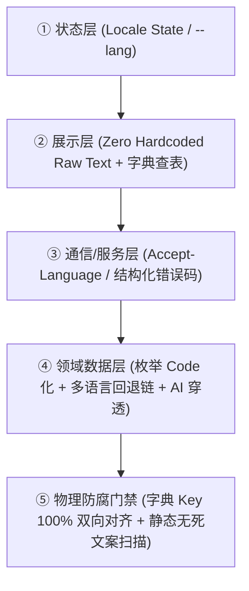

# 全生命周期本地化与视觉主题工程架构规约 (Localization & Theme Architecture)

> 💡 **核心哲学**：本地化（i18n）与主题（Theme）不是渲染期的“局部补丁”，而是贯穿人机交互、数据流、服务契约与 CI 门禁的**一等公民（First-Class Dimension）**。
> 本规约定义了**通用跨栈核心模型**，并提供针对 Web、CLI、后端服务的按需适配器。纯算法库或无交互组件自动豁免。

---

## 🌐 第一部分：通用本地化五层模型 (Universal Localization Model)

无论项目采用何种语言或技术栈，只要存在用户交互输出，均遵循以下 5 层契约：

### 1. 通用核心法则（跨语言、跨技术栈 100% 通用）
1. **零硬编码自然语言 (Zero Hardcoded Raw Strings)**：
   - 核心业务逻辑中**严禁散落面向人类的硬编码自然语言**；所有提示文案、界面文本必须通过模块化字典或语言包管理（如 `locales/zh-CN.json` 与 `locales/en-US.json`）；
2. **服务端/后端严禁拼接人类自然语言**：
   - 接口错误与提示必须返回结构化状态码与参数：`{"error_code": "RESOURCE_NOT_FOUND", "params": {"id": 123}}`，由前端或客户端查字典翻译，杜绝前后端语言撕裂；
3. **字典键双向 100% 对齐门禁 (Key Parity)**：
   - 主语言与所有目标语言的字典键集必须完全一致，任何新增或漏译必须被自动化测试拦截阻断；
4. **纯裸数据传递**：
   - 时间一律返回标准 ISO-8601 UTC，数字与货币返回纯数值，由展示层调用各环境标准的本地化格式化工具（如 JavaScript `Intl`、Python `babel`、Rust `fluent`）渲染。

---

## 🌓 第二部分：视觉主题法则（仅适用于 GUI / Web / 移动端）

> 💡 *注：命令行 CLI 工具、纯后端微服务、离线计算任务自动豁免本部分。*

1. **单一真理源**：
   - 统一由顶层管理 `light` | `dark` | `system`，持久化并派发给根渲染容器；
2. **语义化 Design Tokens，严禁裸写固定色值**：
   - 界面组件严禁写死 `#ffffff`、`#000000`；所有背景、文字、边框必须通过语义变量（如 `surface-primary`, `text-main`）定义，自动响应日夜切换；
3. **零闪烁白屏防御 (Zero FOUC)**：
   - 具有 Web / DOM 渲染环境的工程，必须在首屏渲染前尽早读取偏好并锁定根类名，杜绝样式渲染延迟导致的闪烁。

---

## 🛠️ 第三部分：分端适配器指引（按需选用）

### 1. Web 前端项目适配（Vue / React / Svelte / Native）
- **文案提取**：使用 `t('module.key')`；
- **静态扫描门禁**：
  - Vue 项目推荐集成 `eslint-plugin-vue-i18n` 开启 `no-raw-text: error`；
  - React 项目推荐集成 `eslint-plugin-i18next`；
  - 或配置通用汉字正则扫描测试脚本，对模板目录进行静态断言。

### 2. CLI 命令行项目适配（Python / Go / Rust / Node CLI）
- **参数控制**：统一支持 `--lang [zh|en]` 参数及读取 `LANG` 环境变量；
- **输出格式**：控制台输出统一通过内部国际化 catalog 格式化打印，严禁在执行函数中 `print("中文错误")`。

### 3. 纯后端与 API 项目适配（FastAPI / Spring / Express / Gin）
- **标头识别**：全局中间件解析 HTTP `Accept-Language` 标头；
- **异常契约**：统一抛出继承自结构化异常基类的错误码对象，严禁直接返回面向人类的纯中文字符串。
